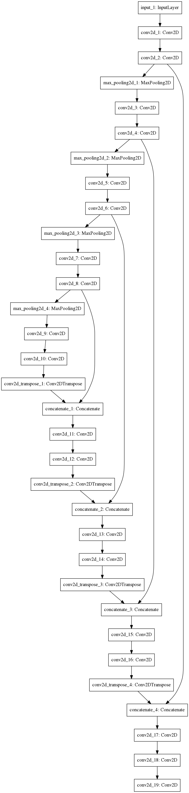

# Week 1 report

## Main goal of the independent study
The main goal of this independent study will be to extend and improve the current segmentation model to support classification with respect to the presence of a prostate and segmentation in a single step using multiple different techniques.

**The three primary techniques will be:**
1. Modifying the architecture to take in triplets of adjacent images and evaluate whether that improves segmentation accuracy.
2. Modifying the architecture to output both mask and binary classification value and evaluate the resulting classification and segmentation accuracy.
3. Identify and pursue a task of my interest related to this problem - TBA.

## Week 1 goals
### 1. Get the base model for the segmentation and evaluate it

#### The base segmentation model 
My baseline will be the segmentation model provided by Dr. Nowling. The base model is based on a deep learning architecture called U-net that takes in an image and outputs a black and white image of the same dimensions where white pixels indicate the location of a prostate. The output of the training and evaluation of the base model can be found here, in the repo.

#### Base model architecture

#### Base model evaluation
| Metric        | Mean           | Standard deviation  | Overall |
| ------------- |:-------------:| -----:| -----: | 
| Dice coefficient      | 0.800      |   0.330 | X |
| Precision -- per image | 0.682     |    0.397 | X |
| Recall -- per image | 0.792      |   0.189 | X |
| Accuracy | X  | X | 0.873 |
| Recall | X | X | 1.00 |

By using the three previously mentioned techniques we'll try to improve these metrics, therefore proof or disproof the following hypothesis which will be the motivation throughout this whole independent study.

**Hypothesis: Using one of the three proposed techniques will improve the classification and segmentation accuracy of the base model.** 

### 2. Start working on the first proposed technique -- taking triplets of images as input
I worked on the pre-processing of the images -- creating triplets from adjacent slices per every patient respectively. I will need to double check if the filenames correspond to the binary predictions when saving the predicted masks and the model will be then ready to train. The changes are to found in the `segment_triplet_images.py` file.