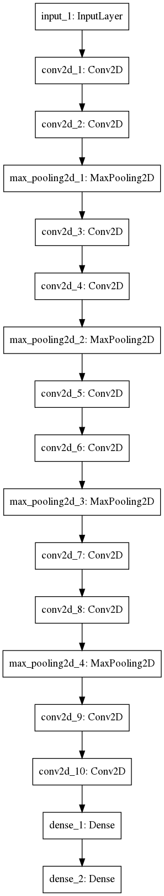

# Week 7 report
The second topic of my independent study will be to try improve the classification model from the first trimester. Here are the metrics of that model -- this will be my starting point that I'll try to improve.

#### Base classification model metrics
##### Accuracy: **0.891**
##### Loss: **0.386** 

I'll be using this two techniques:

1. **Transfer learning** - I'll train the segmentation U-net model, save the weights of the trained model and reuse them in a new CNN model for classification. I'll use the first half of the U-net segmentation model ( the first 5 convolutional layers) and add one or more Dense layers.

    For saving the model I'll use `model.save(filepath)` method which saves a Keras model into a single HDF5 file which will contain:
    - the architecture of the model, allowing to re-create the model
    - the weights of the model
    - the training configuration (loss, optimizer)
    - the state of the optimizer, allowing to resume training exactly where you left off

    I'll also use the `keras.models.load_model(filepath)` to reinstantiate the model after training.

    I'll also try to load only the weights from the U-segmentation model and initialize it into a Dense layer. This will be done using `model.load_weights('my_model_weights.h5')` method. 

2. **Adjusting the U-net segmentation model into classification.**
    I'll adjust the current U-net segmentation model such that it will not output the masks but only the binary classification(containing prostate - true, not containing prostate - false). This is how the adjusted model will look like:
    

