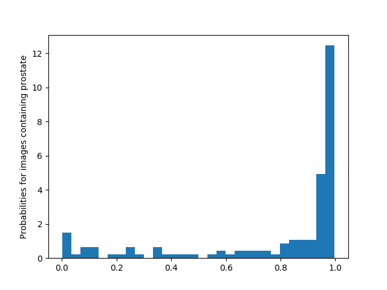
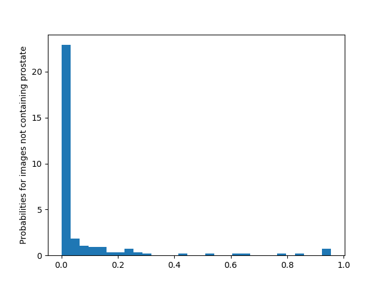

# Week 10 report
By Blasko, Oliver

In week 10 I focused on trying to improve the transfer learning classification model and explore the predicted probabilities of our model.

### Adding the global max pooling layer
We added the global max pooling layer into our network, however not only that the global max pooling layer didn't improve the accuracy of our model it decreased it significantly:

- Accuracy: 0.554
- Loss: 0.675

### Adding the global average pooling layer
Same thing happened with global average pooling layer, accuracy went down significantly and loss increased as well.

- Accuracy: 0.554
- Loss: 0.677

**Result**
It is obvious that pooling layers will not help increase accuracy of our model.

### Printing out the probabilities
We printed out the probabilities and the ground truth labels in order to explore how our model predicts the labels. The probabilities can be found in `probabilities.txt` file.

### Probabilities histogram
Figure 1 - Histogram of probabilities of images that contains prostate( ground truth label > 0 )

Figure 2 - Histogram of probabilities of images that doesn't contain prostate( ground truth label == 0 )
